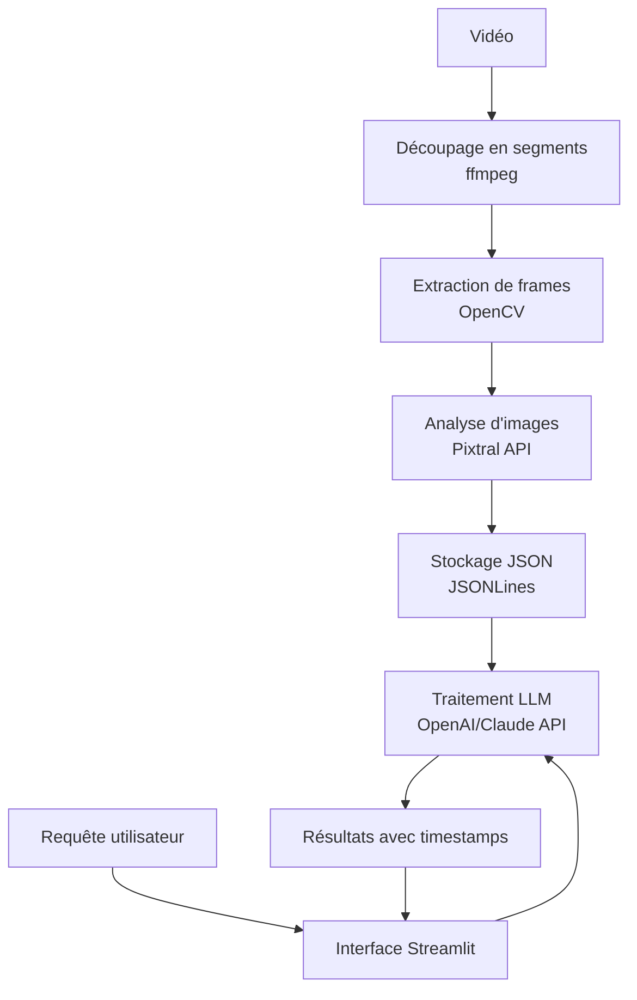

# Prompt pour développer un moteur de recherche vidéo par contenu visuel

Voici le prompt que tu peux utiliser pour demander à un LLM (Claude, Grok, Gemini, etc.) de t'aider à implémenter ce projet:

```
J'ai besoin de développer rapidement (pour un hackathon) un moteur de recherche de séquences vidéo basé sur l'analyse de contenu visuel par IA. Voici le workflow:

1. Découper des vidéos en segments de 30 secondes
2. Extraire 10 frames par segment
3. Utiliser Pixtral-large pour générer des descriptions JSON de chaque frame
4. Stocker ces métadonnées structurées dans une base
5. Permettre à l'utilisateur de rechercher dans ces descriptions via un LLM
6. Retourner les timestamps des segments correspondants

Structure des données:
```json
{
    "video_id": "video123",
    "title": "Conference XYZ",
    "duration": 3600,
    "segments": [
        {
            "segment_id": 1,
            "start_time": 0,
            "end_time": 30,
            "frames": [
                {
                    "frame_id": 1,
                    "timestamp": 3,
                    "descriptions": [
                        {
                            "element": "Eiffel Tower",
                            "description": "A iconic wrought-iron lattice tower located in Paris, France."
                        }
                    ]
                }
            ]
        }
    ]
}
```

Fournissez:
1. Architecture système complète
2. Outils et bibliothèques à utiliser pour un développement rapide
3. Code Python pour chaque composant
4. Guide d'intégration avec Streamlit pour l'interface
5. Approche optimale pour l'indexation et la recherche avec un LLM

Notre stack est basée sur Python. Cherchez les solutions les plus rapides à implémenter.
```

## Architecture technique

Voici l'architecture et les outils que je te recommande pour ce projet de hackathon:



## Composants et outils recommandés

### 1. Traitement vidéo
- **FFmpeg**: Pour le découpage rapide des vidéos en segments
- **OpenCV**: Pour l'extraction optimisée des frames
- **Python-ffmpeg-video-streaming**: Alternative plus simple que FFmpeg pur

### 2. Analyse d'images
- **Pixtral API**: Pour l'analyse des frames
- **HTTPX**: Pour les requêtes API asynchrones (plus rapide que requests)

### 3. Stockage
- **JSONLines**: Format simple et efficace pour stocker les métadonnées
- **LMDB** ou **LevelDB**: Pour un stockage sur disque plus rapide qu'un JSON pur
- **Sqlite**: Alternative simple si tu préfères une base SQL

### 4. LLM et recherche
- **LangChain**: Pour structurer les interactions avec le LLM
- **OpenAI API** ou **Claude API**: Pour le traitement des requêtes
- **FAISS**: Si tu veux implémenter une recherche vectorielle (optionnel)

### 5. Interface
- **Streamlit**: Pour créer rapidement une interface web
- **PyWebIO**: Alternative légère à Streamlit

## Code d'implémentation

```python
# pipeline.py
import os
import cv2
import json
import httpx
import time
from pathlib import Path
import subprocess
import numpy as np
import asyncio
from typing import List, Dict, Any

# Configuration
PIXTRAL_API_URL = "https://api.pixtral.com/analyze"  # Remplacer par l'URL réelle
PIXTRAL_API_KEY = "your_api_key_here"  # Remplacer par ta clé API
OUTPUT_DIR = "processed_videos"
TEMP_DIR = "temp_frames"

# Création des répertoires nécessaires
os.makedirs(OUTPUT_DIR, exist_ok=True)
os.makedirs(TEMP_DIR, exist_ok=True)

# 1. Découper la vidéo en segments de 30 secondes
def segment_video(video_path: str) -> List[Dict[str, Any]]:
    """Découpe une vidéo en segments de 30 secondes et retourne les métadonnées"""
    
    # Obtenir la durée de la vidéo
    cmd = f'ffprobe -v error -show_entries format=duration -of default=noprint_wrappers=1:nokey=1 "{video_path}"'
    duration = float(subprocess.check_output(cmd, shell=True).decode('utf-8').strip())
    
    # Obtenir le nom de la vidéo sans extension
    video_name = Path(video_path).stem
    segments = []
    
    # Découper la vidéo en segments de 30 secondes
    for i in range(0, int(duration), 30):
        end_time = min(i + 30, duration)
        segment_path = f"{OUTPUT_DIR}/{video_name}_segment_{i}.mp4"
        
        # Utiliser FFmpeg pour extraire le segment
        cmd = f'ffmpeg -y -i "{video_path}" -ss {i} -to {end_time} -c:v libx264 -c:a aac "{segment_path}"'
        subprocess.call(cmd, shell=True)
        
        segments.append({
            "segment_id": i // 30 + 1,
            "start_time": i,
            "end_time": end_time,
            "path": segment_path,
            "frames": []
        })
    
    return segments, video_name, duration

# 2. Extraire 10 frames par segment
def extract_frames(segment: Dict[str, Any]) -> List[Dict[str, Any]]:
    """Extrait 10 frames équidistantes du segment vidéo"""
    
    cap = cv2.VideoCapture(segment["path"])
    fps = cap.get(cv2.CAP_PROP_FPS)
    segment_duration = segment["end_time"] - segment["start_time"]
    frame_interval = segment_duration / 10
    
    frames = []
    for i in range(10):
        # Calculer le timestamp dans le segment
        timestamp = i * frame_interval
        # Convertir en numéro de frame
        frame_number = int(timestamp * fps)
        # Définir la position
        cap.set(cv2.CAP_PROP_POS_FRAMES, frame_number)
        # Lire la frame
        ret, frame = cap.read()
        
        if ret:
            # Sauvegarder la frame en tant qu'image
            frame_path = f"{TEMP_DIR}/segment_{segment['segment_id']}_frame_{i}.jpg"
            cv2.imwrite(frame_path, frame)
            
            frames.append({
                "frame_id": i + 1,
                "timestamp": segment["start_time"] + timestamp,
                "path": frame_path,
                "descriptions": []
            })
    
    cap.release()
    return frames

# 3. Analyser les frames avec Pixtral
async def analyze_frame(frame_path: str) -> List[Dict[str, str]]:
    """Envoie une frame à l'API Pixtral et retourne les descriptions"""
    
    # Lire l'image en bytes
    with open(frame_path, "rb") as f:
        image_data = f.read()
    
    # Préparer la requête multipart
    files = {"image": ("image.jpg", image_data, "image/jpeg")}
    headers = {"Authorization": f"Bearer {PIXTRAL_API_KEY}"}
    
    # Envoyer la requête à l'API Pixtral
    async with httpx.AsyncClient(timeout=30.0) as client:
        response = await client.post(
            PIXTRAL_API_URL,
            files=files,
            headers=headers
        )
    
    # Gérer les erreurs potentielles
    if response.status_code != 200:
        print(f"Erreur API: {response.status_code} - {response.text}")
        return []
    
    # Extraire et retourner les descriptions
    result = response.json()
    return result.get("elements", [])

# 4. Traiter une vidéo complète
async def process_video(video_path: str) -> Dict[str, Any]:
    """Traite une vidéo complète et génère les métadonnées structurées"""
    
    print(f"Traitement de la vidéo: {video_path}")
    
    # Segmenter la vidéo
    segments, video_name, duration = segment_video(video_path)
    print(f"Vidéo découpée en {len(segments)} segments")
    
    # Structure pour les métadonnées complètes de la vidéo
    video_data = {
        "video_id": video_name,
        "title": video_name,
        "duration": duration,
        "segments": []
    }
    
    # Traiter chaque segment
    for segment in segments:
        print(f"Traitement du segment {segment['segment_id']}/{len(segments)}")
        
        # Extraire les frames
        frames = extract_frames(segment)
        
        # Analyser chaque frame avec Pixtral (en parallèle)
        tasks = []
        for frame in frames:
            tasks.append(analyze_frame(frame["path"]))
        
        # Attendre que toutes les analyses soient terminées
        frame_descriptions = await asyncio.gather(*tasks)
        
        # Associer les descriptions aux frames
        for i, descriptions in enumerate(frame_descriptions):
            frames[i]["descriptions"] = descriptions
        
        # Ajouter les frames au segment
        segment_data = {
            "segment_id": segment["segment_id"],
            "start_time": segment["start_time"],
            "end_time": segment["end_time"],
            "frames": frames
        }
        
        video_data["segments"].append(segment_data)
    
    # Sauvegarder les métadonnées
    output_path = f"{OUTPUT_DIR}/{video_name}_metadata.json"
    with open(output_path, "w") as f:
        json.dump(video_data, f, indent=2)
    
    print(f"Traitement terminé. Métadonnées sauvegardées dans {output_path}")
    return video_data

# 5. Fonction principale
async def main(video_paths: List[str]):
    """Traite plusieurs vidéos"""
    
    all_videos = {}
    
    for video_path in video_paths:
        video_data = await process_video(video_path)
        all_videos[video_data["video_id"]] = video_data
    
    # Sauvegarder l'index complet
    with open(f"{OUTPUT_DIR}/video_index.json", "w") as f:
        json.dump(all_videos, f, indent=2)
    
    return all_videos

# Pour exécuter le script
if __name__ == "__main__":
    import sys
    
    if len(sys.argv) < 2:
        print("Usage: python pipeline.py video1.mp4 [video2.mp4 ...]")
        sys.exit(1)
    
    video_paths = sys.argv[1:]
    asyncio.run(main(video_paths))

```

```python
# app.py
import streamlit as st
import json
import os
import base64
from pathlib import Path
import requests
from typing import List, Dict, Any

# Configuration
OUTPUT_DIR = "processed_videos"
LLM_API_URL = "https://api.openai.com/v1/chat/completions"  # Remplacer par l'API de ton choix
LLM_API_KEY = "your_api_key_here"  # Remplacer par ta clé API

# Charger l'index des vidéos
def load_video_index():
    index_path = f"{OUTPUT_DIR}/video_index.json"
    if not os.path.exists(index_path):
        return {}
    
    with open(index_path, "r") as f:
        return json.load(f)

# Fonction pour rechercher dans les vidéos avec le LLM
def search_videos(query: str, video_index: Dict[str, Any]) -> List[Dict[str, Any]]:
    """Utilise un LLM pour trouver les segments pertinents basés sur la requête"""
    
    # Préparer le prompt pour le LLM
    prompt = f"""
    Je dispose des métadonnées de vidéos suivantes :
    ```
    {json.dumps(video_index, indent=2)}
    ```
    
    L'utilisateur recherche : "{query}"
    
    Identifie les segments vidéo les plus pertinents pour cette recherche.
    Retourne une liste de résultats au format JSON avec la structure suivante:
    [
        {{
            "video_id": "<id_video>",
            "segment_id": <id_segment>,
            "start_time": <temps_début>,
            "end_time": <temps_fin>,
            "confidence": <score_0_à_1>,
            "explanation": "<explication_de_la_pertinence>"
        }},
        ...
    ]
    
    Retourne uniquement le JSON, sans texte supplémentaire.
    """
    
    # Appel à l'API LLM (exemple avec OpenAI)
    headers = {
        "Authorization": f"Bearer {LLM_API_KEY}",
        "Content-Type": "application/json"
    }
    
    payload = {
        "model": "gpt-4o",  # ou tout autre modèle adapté
        "messages": [
            {"role": "system", "content": "Tu es un assistant spécialisé dans l'analyse de contenu vidéo."},
            {"role": "user", "content": prompt}
        ],
        "temperature": 0.3
    }
    
    response = requests.post(LLM_API_URL, headers=headers, json=payload)
    
    if response.status_code != 200:
        st.error(f"Erreur API LLM: {response.status_code} - {response.text}")
        return []
    
    # Extraire et parser la réponse JSON
    try:
        content = response.json()["choices"][0]["message"]["content"]
        # Extraction du JSON si enveloppé dans du texte
        if "```json" in content:
            content = content.split("```json")[1].split("```")[0].strip()
        elif "```" in content:
            content = content.split("```")[1].split("```")[0].strip()
        
        results = json.loads(content)
        return results
    except Exception as e:
        st.error(f"Erreur lors du parsing de la réponse: {str(e)}")
        st.code(content)
        return []

# Fonction pour générer une vidéo avec le segment mis en évidence
def create_video_highlight(video_id: str, segment_id: int, video_index: Dict[str, Any]) -> str:
    """Crée une vidéo montrant le segment pertinent (optionnel)"""
    # Cette fonction pourrait être implémentée avec FFmpeg pour extraire et montrer le segment spécifique
    pass

# Interface Streamlit
def main():
    st.set_page_config(page_title="Moteur de recherche vidéo", layout="wide")
    
    st.title("🎬 Recherche intelligente dans les vidéos")
    
    # Sidebar pour l'upload de vidéos
    with st.sidebar:
        st.header("Gestion des vidéos")
        
        uploaded_file = st.file_uploader("Télécharger une nouvelle vidéo", type=["mp4", "avi", "mov"])
        
        if uploaded_file:
            # Sauvegarder la vidéo téléchargée
            with open(f"uploaded_{uploaded_file.name}", "wb") as f:
                f.write(uploaded_file.getbuffer())
            
            if st.button("Traiter cette vidéo"):
                st.info("Traitement en cours... Cette opération peut prendre du temps.")
                # Appel au script de traitement (à implémenter)
                st.success(f"Vidéo '{uploaded_file.name}' traitée avec succès!")
    
    # Corps principal
    video_index = load_video_index()
    
    if not video_index:
        st.warning("Aucune vidéo indexée. Téléchargez et traitez des vidéos pour commencer.")
        return
    
    # Afficher les vidéos disponibles
    st.subheader("Vidéos indexées")
    video_count = len(video_index)
    total_duration = sum(data["duration"] for data in video_index.values())
    st.info(f"{video_count} vidéos disponibles • {total_duration/60:.1f} minutes de contenu")
    
    # Recherche
    query = st.text_input("Que recherchez-vous dans ces vidéos?", placeholder="Ex: une personne qui parle devant un tableau...")
    
    if query and st.button("Rechercher"):
        with st.spinner("Recherche en cours..."):
            results = search_videos(query, video_index)
        
        if results:
            st.subheader(f"Résultats pour '{query}'")
            
            for i, result in enumerate(results):
                with st.expander(f"Segment {i+1} • {result['explanation'][:80]}...", expanded=i == 0):
                    # Informations sur le segment
                    col1, col2 = st.columns([2, 1])
                    
                    with col1:
                        video_title = video_index[result["video_id"]]["title"]
                        st.markdown(f"**Vidéo:** {video_title}")
                        st.markdown(f"**Segment:** {result['start_time']:.1f}s à {result['end_time']:.1f}s")
                        st.markdown(f"**Pertinence:** {result['confidence']*100:.1f}%")
                        st.markdown(f"**Explication:** {result['explanation']}")
                    
                    with col2:
                        # Trouver les frames de ce segment
                        segment = next((s for s in video_index[result["video_id"]]["segments"] 
                                        if s["segment_id"] == result["segment_id"]), None)
                        
                        if segment and segment["frames"]:
                            # Afficher une frame représentative
                            middle_frame = segment["frames"][len(segment["frames"])//2]
                            if os.path.exists(middle_frame["path"]):
                                st.image(middle_frame["path"], caption="Frame représentative")
                    
                    # Extraits des descriptions de frames
                    st.subheader("Éléments détectés dans ce segment:")
                    frame_descriptions = []
                    if segment:
                        for frame in segment["frames"]:
                            for desc in frame["descriptions"]:
                                frame_descriptions.append(desc)
                    
                    # Afficher les descriptions uniques
                    unique_elements = set()
                    for desc in frame_descriptions:
                        if "element" in desc and desc["element"] not in unique_elements:
                            unique_elements.add(desc["element"])
                            st.markdown(f"• **{desc['element']}**: {desc.get('description', '')}")

if __name__ == "__main__":
    main()

```

## Optimisations pour gagner du temps

1. **Traitement parallèle** : Utilise `asyncio` pour traiter plusieurs frames simultanément
2. **Mise en cache** : Sauvegarde les résultats d'analyse pour éviter de retraiter les mêmes images
3. **Traitement par lots** : Réduis le nombre d'appels API en envoyant plusieurs images à la fois si l'API le permet
4. **Réduction de résolution** : Redimensionne les images avant de les envoyer à l'API pour accélérer le transfert
5. **Persistance de session** : Utilise une session HTTP persistante pour les appels API

## Pour aller plus loin (si tu as du temps)

1. **Recherche vectorielle** : Convertis les descriptions en embeddings et utilise FAISS pour une recherche plus rapide
2. **UI améliorée** : Ajoute un lecteur vidéo qui saute directement au segment trouvé
3. **Analyse audio** : Ajoute une transcription avec Whisper pour combiner recherche visuelle et textuelle
4. **Indexation incrémentale** : Permets d'ajouter de nouvelles vidéos sans tout retraiter

Ce projet est parfaitement réalisable en 2 jours pour un hackathon, surtout si tu te concentres sur la partie essentielle (la pipeline d'analyse et l'interface de recherche). Bonne chance !