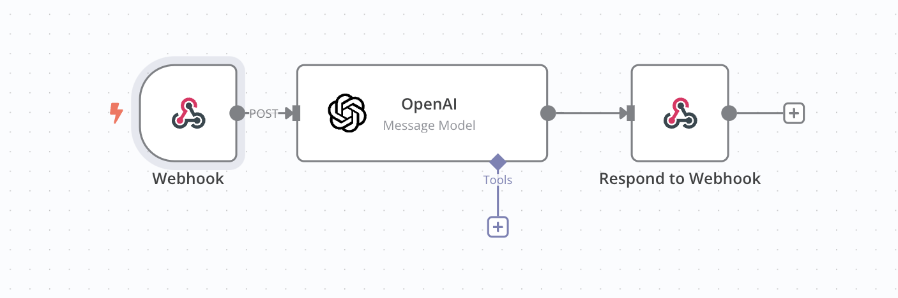

# Hack-my-prompt

Hack my prompt is your new redteaming companion, teaching you to better prompt to harness your business against attacker.

## Front-end

### Technologies

We use [SvelteKit](https://svelte.dev/docs/kit/introduction) for the frontend.

### Install

```sh
cd front
npm install
```

### Start

```sh
npm run start
```

## Backend

### Technologies

You need [bun](https://bun.sh/) to be installed, then all routes are exposed from the `index.ts`
We use as well [n8n](https://marcassin.app.n8n.cloud/workflow/o5qK3VPgQqHSUudl) to run agents

### Install

```sh
cd back
bun i
```

### Start

```sh
cd back
bun run start
```

### N8N



## Redteaming

### How to generate a result from Promptfoo

Obviously, you need promptfoo install

### Step 1: Tests configuration

```sh
promptfoo redteam setup
```

Configure your prompt and strategies

Save to yaml.

Warning:

If you wanna tests with mistral in the config yaml generated.

```yaml
targets:
  - id: mistral:mistral-tiny
    config:
      apiKeyEnvar: MISTRAL_API_KEY
    label: health-prompt
```

### Step 2: Tests generation

```sh
promptfoo redteam generate -c health_config.yaml -j 10 --force --verbose -o health_tests.yaml
```

### Step 3: Test evaluation

```sh
promptfoo redteam eval -c health_tests.yaml --output=health.json -j 10 --verbose
```

Then, the evaluation id is in the log and in the URL.

```sh
promptfoo view
```